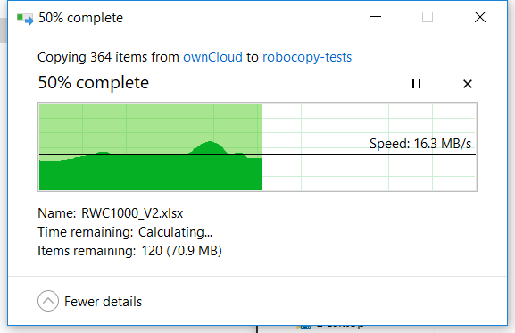
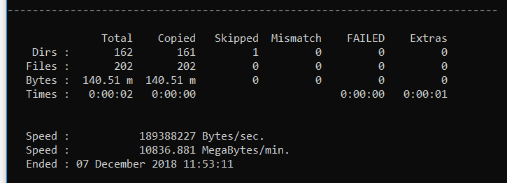

Robocopy is an amazing tool that is built into Windows. If your running Windows 10 you already have it! Just fire up a command prompt and your away.

I've known about and used Robocopy for quite a few years now. In my line of work I often find I need to copy multiple terrabytes of data from one server to another and the standard Windows file copy is just not setup for that.

The standard file copy does some helpful stuff that doesn't scale well. Counting the remaining files, estimating the time remaining, and calculating the total transfer speed all take time and effort that could be spent copying.

Robocopy or _Robust File Copy_ to use its full name is a command line utility that is faster and has quite a few more options than the standard file copier.

## Some Numbers

Lets put some numbers to the performance of robocopy.

First off the standard copy dialog.



To keep things fair I am copying the same 140MB folder from one place on my SSD to another.

Standard File Copy (SFC so I don't have to keep typing it) managed to copy the folder in 9 seconds which isnt bad.

Robocopy on the other hand managed the same copy in 2 seconds.



Thats a pretty good reduction although you do lose more than 7 seconds to opeing command prompt and typing the command out but thats not the point, if you need robocopy over the standard file copy chances are your copying something pretty big.

## More features

Robocopy can do more than just copy files/folders from one place to another. The quickest way to use robocopy is with `/MIR` e.g.

```batch
robocopy C:\Data D:\Backup /MIR
```

`/MIR` or _Mirror_ is a shorthand for `/E /PURGE` which means copy all subdirectories include empty ones (`/E`) and delete files/folders in the destination that are not present in the source (`/PURGE`). Couple this with the fact that robocopy will skip exisiting unchanged files and youve got a great way to migrate data. I frequently run a robocopy that takes hours one week then come back a week later to finish the job and have a really quick robocopy only unpdate the destination with the weeks changes.

There are a multitude of options that can change the way robocopy works. I wont go into them all here `robocopy /?` will list them all for you. The options I use a lot is `/XD` which can exclude directories from your copy and `/XF` which does the same for files. These options are incredibly useful when copying a user profile.

```batch
robocopy C:\Users\Adam D:\Backups\Adam /MIR /XD AppData /XF ntuser.dat
```

This excludes `AppData` that is normally pretty big and contains a lot of content that isnt really something you can copy, `ntuser.dat` is the users registry which if your logged on as the user you are copying will be in use and un readable.

`/W:0 /R:0` also features alot when I do big copies as it reduces the wait time to 0 and the retries to 0 which stops robocopy wasting its time on corrupt or in use files. As menitoned earlier I can simply re run the same copy later and it will only try the files it had problems with again.

The robocopy help file an be read online over on [Microsoft Docs](https://docs.microsoft.com/en-us/windows-server/administration/windows-commands/robocopy) which goes into great detail of the other options robocopy has.
