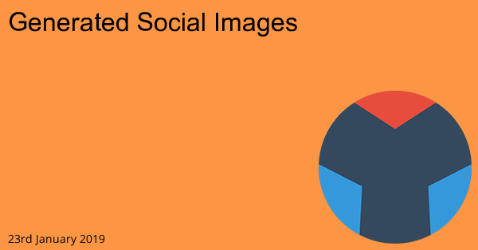

I follow [dev.to](https://dev.to) who have some great images on their tweets that are bascially just the post title and author. I really like the way it looks and want to try something here.

I'm not a fan of manual labour and that includes using photoshop to create an image for each post so that only leaves generating the images with [Gatsby](https://www.gatsbyjs.org/).

# JIMP

I wanted to keep the image generation entirely in Gatsby to keep things easier. This meant I needed a JS only image creation library which is where I found [JIMP](https://www.npmjs.com/package/jimp).

I fire my `createImage` function for nodes that I might share like posts, notes and books during the `on-create-node` hook.

This function creates an image for both Facebook and Twitter that I link to through the open graph tags in the templates `Helmet`.

The images themselves are nothing special just the content background colour, the sites icon, the post date, and the title. Take the one for this post:

The code to do this is pretty simple and can be found in the sites source [here](https://github.com/Arcath/arcath.net-gatsby/blob/master/gatsby/create-page-image.js). I was surprised how easy this turned out to be.

Having gatsby generate the images instead is pretty handy. I can keep the images out of the git repository which is already pretty big and I wont have to remember to make sure they commit.

This is a small feature that most users of the site wont even see but its a nice one to have. I've been more and more impressed with Gatsby as I've been using it to the point that I now think along with Netlify CMS it can be a complete replacement for WordPress for the School websites I build.
